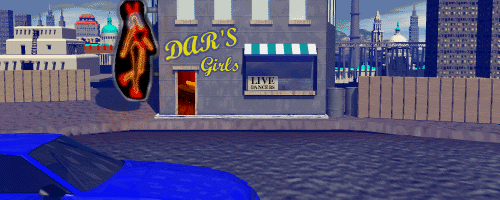

# Areas

Areas are specific regions in a room that provide additional behaviors that apply only within that region.

## Basic properties:

There are basic properties that all areas have:

Mask- The mask is what maps specific pixels on the screen to that area. The mask is currently being fed to the engine via an image (`IMaskLoader` interface is used to load the mask).
You can select whether the transparent pixels in the image indicate the area or the non-transparent pixels indicate the error (this is a parameter you give to the mask loader when loading the mask).
Note: we plan to implement vector-based areas in the future, but currently only pixel masks are available.

Enabled- Whether or not the special behavior of that area is to currently be applied. It can be switched on and off during the game as required.

## Area types:

### Walkable Areas

These are the areas that indicate where the characters can walk. There's an `IsWalkable` property for a walkable area which you can turn on/off during the game. Note that you can also turn the `Enabled` on/off
to achieve the same effect. The difference is that if you have an area which is both a walkable area but also is a different kind an area (areas can have multiple roles) than `Enabled` controls all of area roles,
and `IsWalkable` only affects the area's walk-ability. This same method is used to disable functionalities in other area types accordingly.

As an example, if this is our room:

This might be a walkable area for that room:

### Walk-behind Areas

These are areas that indicate that the background graphic of the room should be in front of the characters/objects. When rendering the engine will actually crop those up and render them on top.
Walk-behinds have a `Baseline` property: The baseline is a horizontal line, which tells the game where the character has to be in order to be drawn behind the area. 
For example, if you had a table in the middle of the room, you'd only want him drawn behind the table if he was standing behind it.
You normally place a baseline at the lowest point of the walk-behind area.

Here's a possible walk-behind for our room:

This walk-behind area masks the car, so if the baseline of the area will be the bottom of the car, if the character is above the bottom line of the car she/he will appear behind the car.

### Scaling Areas

Scaling areas are currently used for 2 things: scaling the size of the characters/objects standing in the area, and scaling the volume emitted from those characters/objects. In the future
we might split those to 2 different area types.
You can turn on/off whether to scale the volume, scale on the x axis and scale on the y axis (usually you'd want to scale both x and y, but you might choose only one of them if you want a stretch/squeeze effect).
The `MinScaling` and `MaxScaling` correspond to the minimum factor and maximum factor that will be applied in the 2 edge points of the areas (so you can put "1" and "1" for no scaling, for example, or "0.5" and "2" for half size to double size),
where the points in between will be interpolated for a smooth transition.
Whether those edge points are vertical or horizontal depends on the `Axis` property which can be set as `X` or `Y`. The default is `Y`, meaning by default the scaling area is a vertical scaling area, which is common to have
when drawing your background with perspective. For a vertical scaling area, the `MinScaling` property will match the top-most point in the area and the `MaxScaling` to the bottom-most point in the area, so this is composed
by default to help you fake perspective (and scaling the emitted volume, like footsteps, by default does the same thing).
Note that objects/characters have a `IgnoreScalingArea` property which can be turned on/off to not change scaling while in scaling areas.

### Zoom Areas

These are areas that indicate the camera should automatically zoom when the player (or whatever other target was chosen for the camera) is in that area. 
This works along nicely with a vertical scaling area, to zoom the camera as the player moves farther away from the camera.
Besides the `ZoomCamera` flag which can turn zooming on/off, there's a `MinZoom` and `MaxZoom` properties which correspond with the `Y` property of the camera's target. 
The lowest point in the area, which usually corresponds to the closest distance to the camera (if your background has perspective) will match the `MinZoom` where the upper most point 
in the area will match the `MaxZoom`. Any point in between will be interpolated to get the matching camera zoom.
Note that the default implemented camera does not do any sharp movement, but slowly adjusts toward its goal for smooth movements. If you want a different behavior from your camera, you
can code your own camera by implementing the `ICamera` interface. If you code your own, you'll need to adjust to the zoom areas in your camera's code (if you want that feature in your camera, that is).

## Area restrictions:

It is sometimes useful to have an area only affect specific objects/characters within it, but not all. For this purpose you can add an "Area restriction" component to your area.
This component comes with a restriction list which you can provide with the IDs of the objects/characters/etc, and an additional `RestrictionType` which can be set to either a black list or a white list.
A white list means that only those entities which are on the list will be affected by the area while other entities will not. A black list means that only those entities which are on the list will
not be affected by the area while all other entities will be affected.